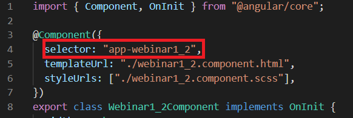
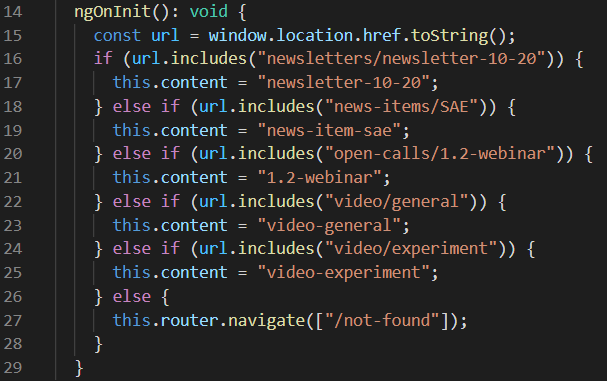

In the case that you need to create a page to hold some kind of content, which doesn't seemingly fit anywhere else and is a "1-off" thing, you might want to create a content page. This is page that will be accessible through the following url: www.hubcap.eu/content/category/content-piece, where `category` and `content-piece` could be something like "video/general" or "open-calls/1.2-webinar", etc. You would have to write the html for this page on your own.

**1.** In the terminal run the command `ng g c NameOfContentPage` where `NameOfContentPage` is a descriptive title for your content.

**2.** Move the newly created folder into the `content-items` folder.

**3.** In the newly created folder, open the `X.component.ts` file and take note of the `selector` property. It looks like this:



This selector will be used when referencing this component in html later on.

**4.** Open the `content.component.ts` file located in the `content` folder and locate the string of `else if` clauses which looks like this:



**5.** Add an `else if` clause following the same pattern before the final `else` while replacing the category/content-piece in `url.includes(category/content-piece)` with your desired url for this page and the **content_title** in `this.content = "content_title"` with some descriptive title for your content (will not be visible to users, acts more like an ID of sorts).

**6.** Open the `content.component.html` file and add a `<div>` element (within the `<div class="wrapper">...</div>` element) which represents your page like so:

```
 <div *ngIf="content === 'content_title'">
    <app-...></app-...>
 </div>
```

where **content_title** is the content title you chose in step 5 and **app...** is replaced by the selector you noted down in step 3.

**7.** Finally, open the `X.component.html` file in the folder you created in steps 1 and 2 and write your custom html in there.
