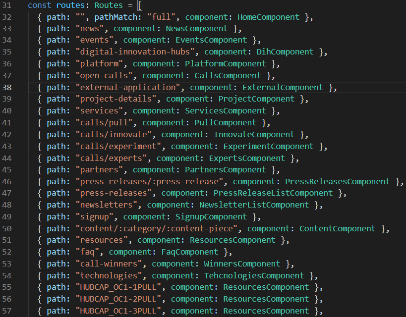

In the case that you need to create a new page which can be accessed via a custom url, do the following:

**1.** In the terminal run the command `ng g c NameOfPage` where `NameOfPage` is a descriptive title for your new page.

**2.** In the newly created folder, open the `X.component.html` file to write your custom html. You can also use the `X.component.ts` and `X.component.scss` files to write any TypeScript or SCSS you might need respectively.

**3.** In order to set up the routing for your new page, open the `app-routing.module.ts` file, located in the `app` folder in `src` and find the `routes` array, which looks like this:



This array contains all the routes for the entire website.

**4.** Import your newly created component's `.component.ts` file at the top of the routing file like so:

```
import { MyNewComponent } from "./my-new-component/my-new-component.component";
```

**5.** Add an object of the following structure to the `routes` array (**NOTE:** Add the object anywhere above the last two objects, which are responsible for handling **404** errors):

```
{ path: "desired/path/for/url", component: MyNewComponent }
```

If you now go to (on localhost:4200) http://localhost:4200/desired/path/for/url, you should see your new component/page displayed.
