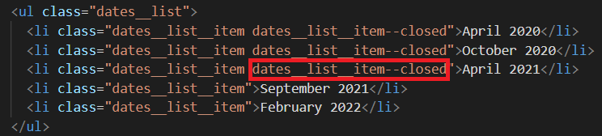
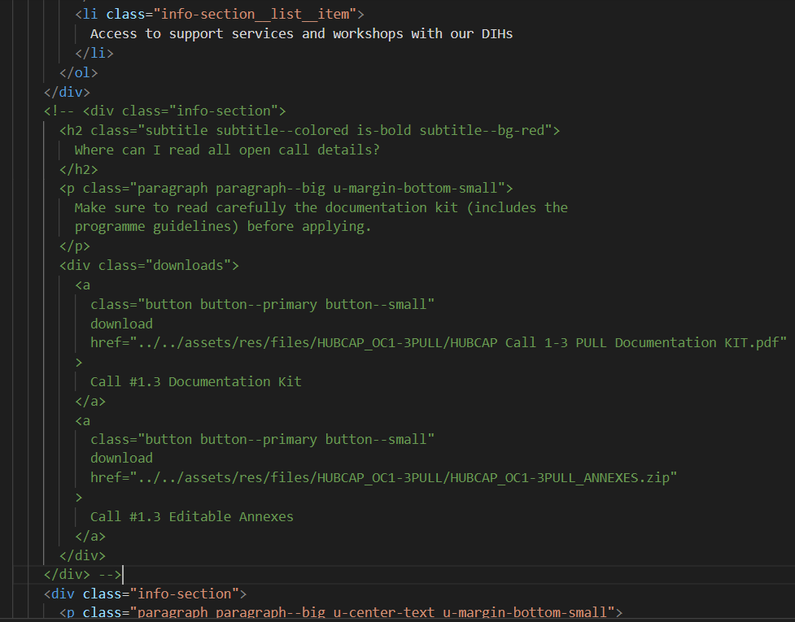

In order to close a call, simply follow the steps in the [guide for opening a call](/opening-a-call) in reverse.

You don't need to delete any of the previously created files or components. The only extra steps you need to take are the following:

**1.** Disable the buttons on the call page by adding the `disabled` attribute.

**2.** Edit the list item in the call page corresponding to your call to include the `dates__list__item--closed` CSS class like so:

**3.** Again on the call page, you should also comment out (but not delete) the "files" section. It should look like this after you edit it:

