Opening a call on the website happens in a few places. This guide will go through the process page-by-page.

Let's start with the homepage:

**1.** Open up `home.component.html` (located in the `home` folder in `app`).

**2.** Scroll down to the `<section>` element with a class of `open-calls`

**3.** Here you will find 3 subheadings for each of the open call slides. They can be distinguished by the `slide.heading.includes('#CALL_NUMBER)')` statements and look like this:

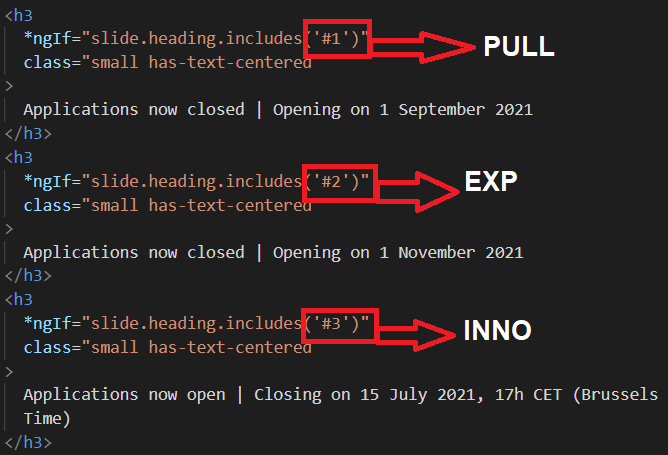

**4.** Change the wording for the appropriate call to "Applications now..."

**5.** Next up in the `home.component.ts` file, locate the `slides` array, which looks like this:

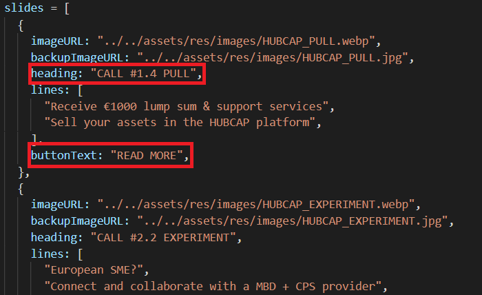

**6.** Change the `heading` of the call you mean to open to the appropriate number

**7.** Change the `buttonText` property from "READ MORE" to "APPLY NOW"

**8.** Next open the `calls.component.html` file located in the `calls` folder

**9.** In here we need to change the wording of the button for the specific call from "READ MORE" to "APPLY NOW". To do so find the `<div>` element with a class of `row icons` and locate the button for the call you're trying to open. Each call container looks like this:

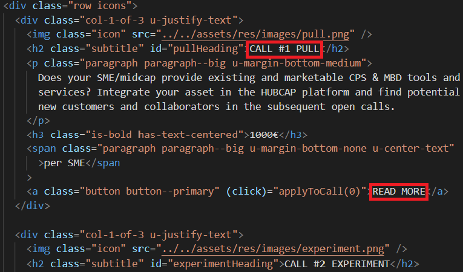

**10.** Next up locate the folder with the name of the call you are trying to open (I will use PULL for this example).

**11.** Change the closing/opening dates and wording at the top and bottom of the page

**12.** In the list of call dates, locate the current call and add `<b>(OPEN)</b>` next to the month and year to make it look like so:

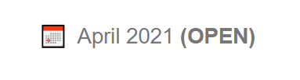

**13.** In each call page you will find a "files" section which is commented out when the call is closed. In order to open it, you need to uncomment this section and point to the correct files, such as the documentation kit, flyers, etc. The section normally looks like this in terms of code:

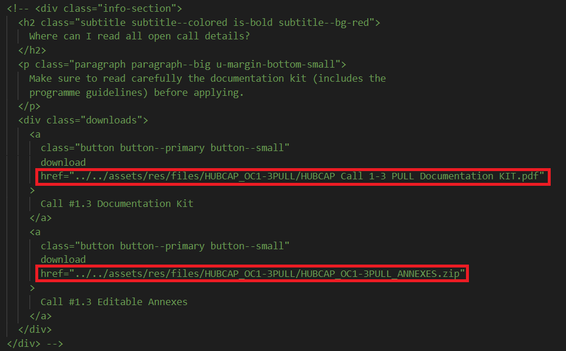

You need to correctly point to the files which should be located in the `assets/res/files/CALL_NAME` folder.

**14.** Enable the buttons at the top and bottom of the page by removing their `disabled` attribute

**15.** Open up the `CALL_NAME.component.ts` file and edit the link used within the `openApplyPage` function to point to the correct F6S page (get from Catarina):

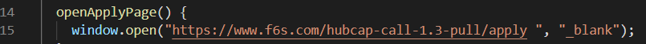

**16.** We now need to add the necessary files to our `assets/res/files/CALL_NAME` folder in order to make the available for downloading and online viewing. Place any social images, the press release article .docx file as well as the documentation kit for the call inside the folder. Remember to also add a .zip archive of all the editable annexes needed by the applicants. The finished folder should look something like this:

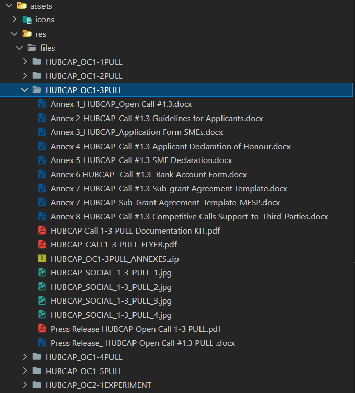

**17.** Open the `resources.component.html` file and locate the `<ul class="downloads__list">` element which corresponds to the call you're opening (I've already written them out). Uncomment the entire `<ul>` element containing the list of files for view and download. Correct any links which might be pointing to the wrong resources within the `files` folder and test by clicking the "Download" and "View" buttons for each one. If any of them fail to download because of "File not found" error or similar - check that the name is written out properly and in the exact same style as in other calls. For example if you were uploading the press release .docx file for call 1.4 you would check the name of the press release file for call 1.3 and follow the naming convention. Example:

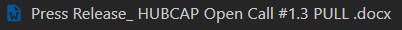

So you would name the file for 1.4: **Press Release\_ HUBCAP Open Call #1.4 PULL.docx**. **Note:** Spaces and symbols matter.

**18.** Next open the `resources.component.ts` file and locate the commented out line `// Call #X.X` which corresponds to your call. It should look like this:

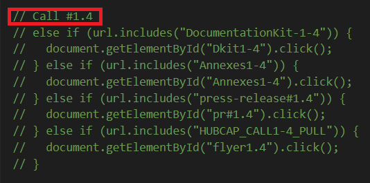

Uncomment the next few lines below it to enable links to trigger file downloads. For example when someone visits a link which contains the name of the call and one of the resources a click on the download button for that resource is simulated. Make sure not to change the `id` attributes for each resource in the .html file. Just change the `href` attribute.

**19.** Lastly for the resources page we need to uncomment the correct "Media Kit" section for this call - find the `<div class="media-kit__section">` element which corresponds to the call you are trying to open. It should look something like this:

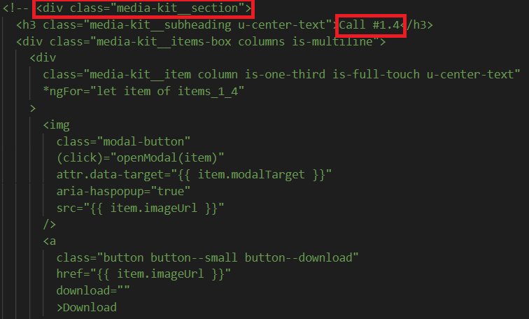

The media section html is already configured to work after being uncommented, the only thing you need to do is open the `resources_CALL_NAME.ts` file in the `resources` folder (in my example that would be `resources_pull.ts`) and locate the items_CALL_NUMBER array which corresponds to your call. In the case of 1.4 that would be `export const items_1_4 = [ ... ]`. In that array you can either clear the current placeholder contents or simply replace the `imageUrl` and `modalTarget` properties for each file with the equivalent ones for your call. I've already set them up to point to the correct folders so just adding the name of each file at the end should be fine.

**20.** When opening each call we also need to make a page for the press release. I've already taken care of that and created all the necessary components for each of the future press releases. so the next 6 steps will be **OPTIONAL** in case you need to create a new press release (other than for calls 1.4, 1.5 and 2.2). If you're opening one of the 3 mentioned skip the next 6 steps.

**OPTIONAL**

---

**21.** In the terminal run the command `ng g c PressReleaseArticleX_X` where X_X represents the call number.

**22.** Move the newly created folder into the press-release-articles folder.

**23.** Open the `press-releases.component.ts` file located in the `press-releases` folder and located the string of `else if` clauses which looks like this:

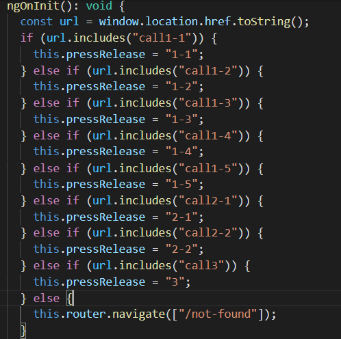

**24.** Add a `else if` clause following the same pattern before the final `else` which corresponds to your call number.

**25.** Finally, open the `press-releases.component.html` file and add a `<div>` element which represents your call like so:

```
 <div *ngIf="pressRelease === 'X.X'">
      <press-release-articleX_x></press-release-articleX_X>
 </div>
```

Where X_X is replaced by the number of your call.

**26.** In order to write a page for the press release you can either use one of the previous ones as an example or simply open up the `.component.html` file of the component you created earlier and write your new markup in there.

---

**END OF OPTIONAL**

**27.** Lastly, we need to make the press release visible in the `press-relase-list.component.ts` file in the `press-release-list` folder. Open that file up and locate the `releases` array.

**28.** It will contain the commented out press release objects for calls 1.4, 1.5 and 2.2 so simply uncomment the one you need. Alternatively if you're creating a new one - copy one of the old ones and replace with your new values. The commented out objects look like this:

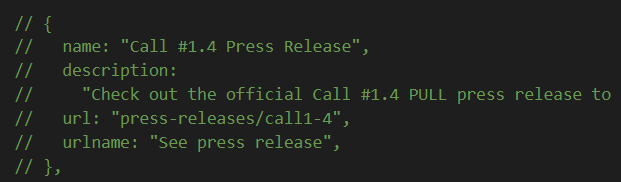

**29.** Replace the `description` property with accurate text and change the call number in the `name` and `url` properties.

**30.** If you wish to edit the html for a specific press release there are comments above each object which state in which file to do so.
