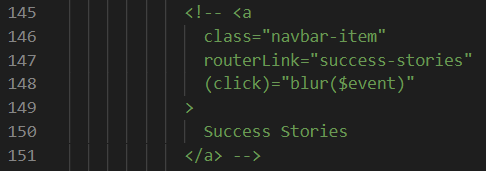

To enable the "Success Stories" menu item located in the "About" menu dropdown, do the following:

**1.** Open the `navigation.component.html` file within the `navigation` folder.

**2.** Locate the commented out menu item. It looks like this:

**3.** Uncomment it.
