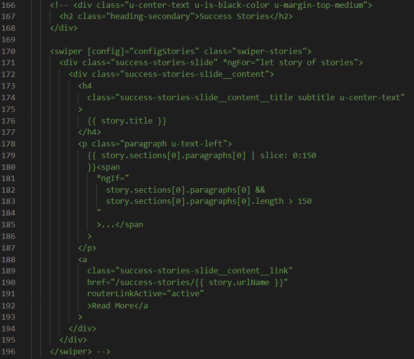

The success stories slider is located on the homepage below the video. It lists an item for each success story listed within the `success-stories.ts` file in the `success-stories-list` folder. To enable it:

**1.** Locate the html for it within `home.component.html`. It looks like this:

**2.** Uncomment it.

**3.** If you wish to perform updates on the styling of the slider, look into the `swiper-stories` SCSS rule within `home.component.scss` as well as the `_success-stories-slide.scss` file in the `sass/components` folder.
