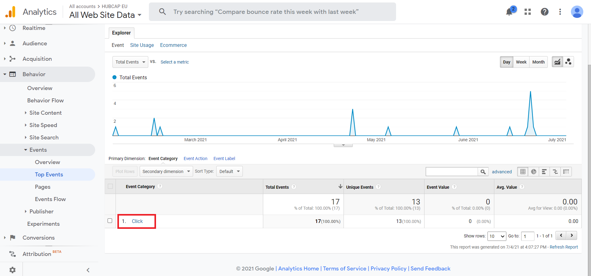

This article will cover **updating the "Website Traffic Monitor" document weekly** as well as **tracking of events** such as newsletter downloads.

Firstly, some background. The Website Traffic Monitor Excel spreadsheet is located on SVN under WP7/Website Traffic/Website Traffic Monitor.xlsx. This contains all of the weeks of traffic reports, excluding the latest one at any given time. There is also a Website Traffic Monitor page on the Wiki, located [here](https://wiki.eng.au.dk/display/IN/Website+Traffic+Monitor). This only contains the latest week of traffic info at any given time in order to avoid having a massive file hosted on the Wiki where it becomes hard to edit.

When performing weekly analytics reporting:

**1.** Open the Wiki Website Traffic Monitor page and copy the latest tracking info. This includes the title "Week N (xx/xx/xxxx - xx/xx/xxxx)" as well as both tables and the subheadings "By Country" and "By Source/Medium".

**2.** Open up the Website Traffic Monitor Excel document located in the SVN.

**3.** Scroll to the bottom and paste in the info you copied 2 rows below the last table in the document.

**4.** Save the changes and commit to SVN.

**5.** Go back to the wiki WTM page and change the dates in the title to match the week you're reporting for and also increment the week number.

**6.** Delete both tables, leaving only the two subheadings "By Country:" and "By Source/Medium:"

**7.** Open the page for [tracking visitors by country](https://analytics.google.com/analytics/web/?authuser=1#/report/visitors-geo/a177616288w245901214p228514249/_u.date00=20210627&_u.date01=20210704/).

**8.** Log in using hubcapnewsletterfwd@gmail.com (you should already have the password).

**9.** Using the date range picker in the upper right-hand corner, choose the date range for the week you're reporting for. It looks like this:

**10.** Once the page has refreshed following the choice of date range - scroll down to the bottom where it says "Show rows..." and select a big number like 250 in order to list out all the countries in the table. It looks like this:

**11.** After the table has updated, scroll back up to the top and click on "Export" and then select "Google Sheets" from the dropdown menu. Here's what it looks like:

**12.** Once prompted - click on the blue "Import data..." button on the page that just opened up to import the data into a Google Sheets spreadsheet. You should be redirected to a page that looks like this:

**13.** On this page - select the "Bounce Rate" column as well as the last 3 columns in the table ("Goal Conversion", "Goal Completion" and "Goal Value") and delete them from the table. Here's what they look like when marked:

**14.** Now move the last two columns towards the rest of the columns to make the table complete again with no gaps. Like so:

**15.** Mark and copy the entire table.

**16.** Paste it below the "By Country:" subheading in the wiki WTM page.

**17.** Now select the bottom row of the table and highlight it using "Light Green 35%" like so:

**18.** Select the entire "New Users" column and make it bold (including the header cell).

**19.** Select all header cells and highlight them in "Light Blue 35%" like so:

**20.** For the Source/Medium table, go to the [Google Analytics Source/Medium page](https://analytics.google.com/analytics/web/?authuser=1#/report/trafficsources-all-traffic/a177616288w245901214p228514249/_u.date00=20210627&_u.date01=20210704&explorer-table.plotKeys=%5B%5D&explorer-table.rowCount=100&explorer-table.advFilter=%5B%5B0,%22analytics.sourceMedium%22,%22PT%22,%22localhost:4200%20~2F%20referral%22,1%5D%5D/).

**21.** Follow the same steps as for the first table and paste the new info in below the "By Source/Medium:" subheading.

**22.** Click on "Update" in the wiki page to complete the report updating process.

**FOR EVENTS TRACKING**

---

**1.** Open up the [Google Analytics Events Tracking page](https://analytics.google.com/analytics/web/?authuser=1#/report/content-event-events/a177616288w245901214p228514249/_u.date00=20210201&_u.date01=20210704/).

**2.** Click on the "Click" Event Category in the table at the bottom. Here's what it looks like:

**3.** You should now be seeing the table of events like so:

**4.** To add tracking of a new event, login to [Google Tag Manager](https://tagmanager.google.com/?authuser=1#/container/accounts/6002371100/containers/33786739/workspaces/2) using hubcapnewsletterfwd@gmail.com again.

**5.** You should be in the HUBCAP EU/www.hubcap.eu container with and ID of "GTM-KCGN947".

**6.** Follow [this article](https://www.optimizesmart.com/event-tracking-in-google-tag-manager-v2-complete-guide/) to add tracking for a new event.
